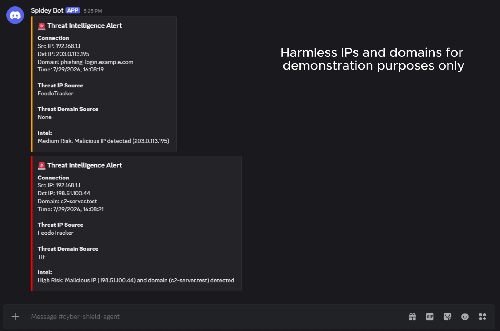
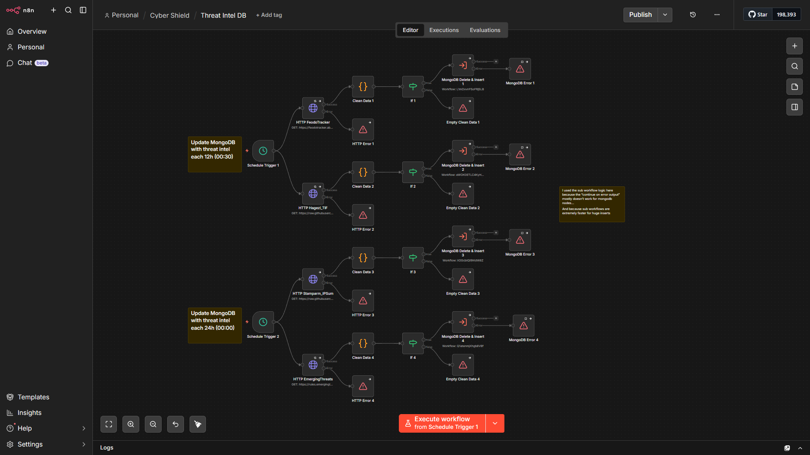
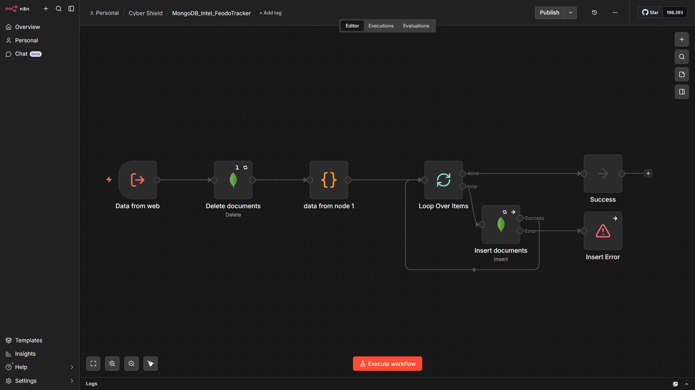
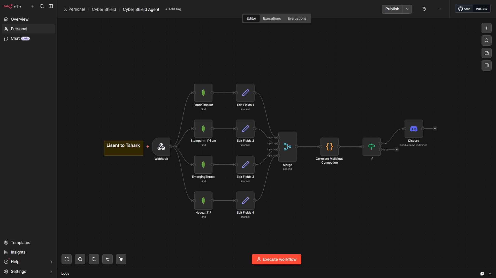

# Cyber Shield: Threat Intelligence & Real-Time Alerting System (NDR)
*Built with n8n Workflows, ETL, and PowerShell/Tshark*


## 🎬 Live Demo
[https://drive.google.com/file/d/1ADcJ2MZzeHz0UhCKbCBBpWKSe56JtM7-/view?usp=sharing](https://drive.google.com/file/d/1DCuPBbUfLUMvwi_PXXia7v8M6qRG-S37/view?usp=sharing)

## 📑 Table of Contents

### Overview & Architecture

- [1. Overview](#1-overview)
  - [How It Works: Core Operational Loops](#how-it-works-core-operational-loops)
  - [Key Capabilities at a Glance](#key-capabilities-at-a-glance)
  - [Why SNI Inspection Instead of IP-Only Matching?](#why-sni-inspection-instead-of-ip-only-matching)
  - [Discord Alert Preview](#discord-alert-preview)
- [2. System Architecture & Component Workflow](#2-system-architecture--component-workflow)

### Sensor & Telemetry

- [3. Sensor Deployment Script (Tshark PowerShell Agent)](#3-sensor-deployment-script-tshark-powershell-agent)
  - [Configuration Variables](#configuration-variables)
  - [Script Execution Flow & Payload Schema](#script-execution-flow--payload-schema)

### Workflows & Detection Logic

- [4. Workflow Specifications](#4-workflow-specifications)
  - [Threat Intelligence Data Pipeline (`Threat Intel DB`)](#a-threat-intelligence-data-pipeline-threat-intel-db)
  - [External Threat Intelligence Sources](#external-threat-intelligence-sources)
  - [Batch Insertion Sub-Workflows (`MongoDB_Intel_dbname`)](#b-batch-insertion-sub-workflows-mongodb_intel_dbname)
  - [Real-Time Detection Engine (`Cyber Shield Agent`)](#c-real-time-detection-engine-cyber-shield-agent)
- [5. Threat Scoring & Discord Alert Format](#5-threat-scoring--discord-alert-format)
  - [Risk Scoring Matrix](#risk-scoring-matrix)
  - [Discord Alert Preview Example](#discord-alert-preview-example)

### Database & Performance

- [6. Database Schema (MongoDB `threat_intel`)](#6-database-schema-mongodb-threat_intel)
  - [Database Indexes & n8n Queries](#database-indexes--n8n-queries)
    - [Scenario A: Dedicated Collections (Default Setup)](#scenario-a-dedicated-collections-default-setup---fastest-performance)
    - [Scenario B: Mixed Indicator Collections](#scenario-b-mixed-indicator-collections)

### Deployment & Operations

- [7. Quick Start: Setup & Execution](#7-quick-start-setup--execution)
  - [Prerequisites](#1-prerequisites)
  - [Infrastructure Setup (n8n & MongoDB)](#2-infrastructure-setup-n8n--mongodb)
  - [Sensor Configuration](#3-sensor-configuration)
  - [Running the Script & Execution Policies](#running-the-script--execution-policies)

### Roadmap & Legal

- [8. Potential Upgrades & Future Enhancements](#8-potential-upgrades--future-enhancements)
- [9. License & Disclaimers](#9-license--disclaimers)
  - [Software License](#software-license)
  - [Threat Intelligence Data Attribution](#threat-intelligence-data-attribution)
  - [Security & Liability Disclaimer](#%EF%B8%8F-security--liability-disclaimer)


## 1. Overview

**Cyber Shield** is a lightweight host-based automated Network Detection and Response (NDR) system. It passively watches outbound network traffic, cross-references connection targets against live global threat intelligence databases, and instantly sends structured security alerts to Discord when suspicious activity is detected.

Built using **n8n**, **MongoDB**, **Tshark (Wireshark)**, and **Discord**, Cyber Shield bridges automated orchestration with low-level network visibility (combining domain identification, IP lookup, and passive TLS fingerprinting capabilities) to deliver proactive threat detection without heavy infrastructure overhead.

---

### How It Works: Core Operational Loops

Cyber Shield operates through two continuous, automated workflows:

1. **Threat Intelligence Pipeline (Data Ingestion)**
   * **What it does:** By default, it automatically fetches, normalizes, and stores over **30,000+ malicious IP addresses and 160,000+ malicious domain indicators** from reputable security feeds (Feodo Tracker, Hagezi TIF, Stamparm IPSum, and Emerging Threats). (this setup is pretty balanced because an IP address could use multiple domains)
   * **Sync Frequency:** Runs on **12-hour** schedules for some feeds and **24-hour** schedules for others, depending on each feed's expiration and update rate to keep local threat data current.

2. **Real-Time Detection & Alerting Engine**
   * **Traffic Sensing:** A lightweight PowerShell sensor running Tshark inspects active network connections in 30-second windows.
   * **IP & Domain Correlation:** Evaluates both destination IP addresses and domain names. To inspect domains on encrypted HTTPS connections, the sensor extracts TLS handshake telemetry (such as Server Name Indication) directly from the initial packet exchange, allowing Cyber Shield to detect malicious web traffic without needing decryption keys or proxy certificates.
   * **Severity Scoring & Alerting:** When a match occurs, the system evaluates the risk (High vs. Medium Risk) and sends a detailed, formatted alert directly to a Discord incident channel.

### Key Capabilities at a Glance

* **Hybrid Indicator Matching:** Checks both IP addresses and domain names to catch threats even when IP addresses change dynamically.
* **Non-Invasive Domain Inspection:** Uses passive TLS handshake inspection (SNI) to see requested hostnames over HTTPS without interfering with user privacy or network performance.
* **Lightweight Edge Architecture:** Offloads heavy database queries and correlation logic to background n8n workflows, keeping the network sensor footprint minimal.

### Why SNI Inspection Instead of IP-Only Matching?

* **Shared CDN & Multi-Tenant Protection:** Pinpoints the exact malicious domain on shared cloud IPs (e.g., Cloudflare, AWS, Fastly) without triggering false-positive alerts on thousands of legitimate websites co-hosted on the same IP.
* **Fast-Flux & IP-Rotation Evasion:** Retains threat visibility when malware dynamically rotates Command & Control (C2) server IP addresses while relying on persistent or algorithmic domain names.

### Discord Alert Preview



---

## 2. System Architecture & Component Workflow

```
[ Edge Network Sensor ]
     (Tshark / PS1)
           │
           │ HTTP POST (Header Auth)
           ▼
[ n8n: Cyber Shield Agent ] ◄─────── [ MongoDB Threat Intel DB ]
           │                                 ▲
           │ Risk Scoring & Correlation      │ 12h & 24h Scheduled Syncs
           ▼                                 │
[ Discord Alert Channel ]            [ Threat Intel DB Workflow ]
                                             │
                                             ├── FeodoTracker Feed (12h)
                                             ├── Hagezi TIF Domains (12h)
                                             ├── Stamparm IPSum Feed (24h)
                                             └── EmergingThreats Feed (24h)

```


---

## 3. Sensor Deployment Script (Tshark PowerShell Agent)

Network traffic is captured via a dedicated PowerShell script (included in this repository) that acts as a continuous wrapper around `tshark`. It actively sniffs network interfaces for outbound connections and forwards the telemetry to the n8n agent.

### Configuration Variables

Before running the script, open it and define the following variables at the top of the file:

| Variable | Description |
| --- | --- |
| `$WebhookUrl` | The full HTTP endpoint of your n8n Cyber Shield Agent Webhook. |
| `$InterfaceNum` | The numeric ID of the network interface tshark should listen on (Run `tshark -D` to find your interface number). |
| `$SecretKey` | Your custom API Key / Password, sent via the `X-API-KEY` header to authenticate with n8n. |

### Script Execution Flow & Payload Schema

The script runs in an infinite loop, capturing network data in batches and structuring it before transmission.

#### Internal Workflow Tree

```text
[Start Infinite Loop]
 │
 ├──► 1. Traffic Capture (30-second window)
 │       Target: TLS SNI handshakes (tls.handshake.type == 1)
 │
 ├──► 2. Data Extraction
 │       Fields mapped: timestamp, src_ip, dst_ip, domain
 │
 ├──► 3. Noise Filtering
 │       Drops empty lines.
 │       Drops Loopback, Private Subnets, Multicast, Reserved, and Broadcast destinations (127.*, 192.168.*, 10.*, 172.16-31.*, 224.0.0.0+).
 │
 ├──► 4. Deduplication
 │       Groups identical connections (src, dst, domain) within the same window.
 │       Preserves only the timestamp of the first packet.
 │
 ├──► 5. Payload Transmission
 │       Action: HTTP POST to Webhook
 │       Headers: { "X-API-KEY": "$SecretKey", "Content-Type": "application/json" }
 │       Body: JSON Array of structured events (See Schema below)
 │
 └──► 6. Cooldown (2 seconds)
         Loops back to Start
```

#### Transmitted JSON Payload Schema

The webhook receives a deduplicated JSON array of connection objects matching this schema:

```json
[
  {
    "src_ip": "192.168.1.100",
    "dst_ip": "104.18.32.7",
    "domain": "malicious-example.com",
    "timestamp": "2026-07-21T10:13:08.022703900+0100"
  },
  {
    "src_ip": "192.168.1.100",
    "dst_ip": "93.184.216.34",
    "domain": "another-domain.org",
    "timestamp": "2026-07-21T10:13:07.904673400+0100"
  }
]
```
---

## 4. Workflow Specifications

### A. Threat Intelligence Data Pipeline: `Threat Intel DB`

* **Purpose:** Scheduled synchronization of external threat intelligence feeds at different intervals based on update frequency to continuously refresh the target MongoDB collections.
* **Execution Trigger:** Schedule 1 for every 12 hours (00:30). Schedule 2 for every 24 hours (00:00)



#### Why Sub-Workflows are Used:

* **Performance:** Direct MongoDB node batch updates in primary canvas can stall or drop under heavy loads.
* **Reliability:** Standard n8n MongoDB nodes experience issues with "Continue on error output". Delegating updates to dedicated sub-workflows allows for safer batch loops (5,000 records/iteration) and error isolates.

### External Threat Intelligence Sources

By default the system fetches raw text feeds from four external sources:

| Source Name | Raw Feed Endpoint URL | Indicator Type | Description & Focus |
| :--- | :--- | :--- | :--- |
| **Abuse.ch Feodo Tracker** | `https://feodotracker.abuse.ch/downloads/ipblocklist.txt` | IP (`ip`) | ~5–20 high-confidence active Botnet Command & Control (C2) server IP addresses targeting high-profile malware families (e.g., Dridex, TrickBot, QakBot). |
| **Hagezi TIF (Mini)** | `https://raw.githubusercontent.com/hagezi/dns-blocklists/main/wildcard/tif.mini-onlydomains.txt` | Domain (`domain`) | ~160k highly accurate malicious domains, serving as the primary SNI correlation target. |
| **IPsum (Level 2)** | `https://raw.githubusercontent.com/stamparm/ipsum/master/levels/2.txt` | IP (`ip`) | ~30k aggregated threat list containing malicious IPs flagged on at least **2 or more** distinct blacklists. |
| **Emerging Threats** | `https://rules.emergingthreats.net/blockrules/compromised-ips.txt` | IP (`ip`) | ~600 daily list of verified compromised hosts and active attack source IP addresses. |

---

### B. Batch Insertion Sub-Workflows (`MongoDB_Intel_dbname`)

* **Purpose:** Wipes old threat intelligence records and performs batch inserts of fresh indicators in MongoDB.



* **Batching Configuration:** `batchSize: 5000`.


* **Database Target Collections:**
* `intel_feodotracker`

* `intel_ipsum`

* `intel_emergingthreats`

* `intel_tif`

---

### C. Real-Time Detection Engine: `Cyber Shield Agent`

* **Purpose:** Inspect incoming live connection streams against active threat feeds and trigger automated Discord alerts when high/medium-risk indicators are identified.


* **Ingress Method:** HTTP Webhook (`POST`) protected via Header Authentication.



#### Node Breakdown & Logic:

1. **Webhook Node (`Listen to Tshark`):** Receives structured network traffic logs containing `src_ip`, `dst_ip`, `domain`, and `timestamp`.


2. **MongoDB Parallel Query Nodes (`FeodoTracker`, `Stamparm_IPSum`, `EmergingThreat`, `Hagezi_TIF`):** Queries MongoDB collections to match incoming destination IPs and domains. *(Note: The exact query syntax depends on your database index setup. See **Section 6** for the specific JSON queries to use here).*


3. **Set / Edit Fields Nodes:** Appends an `intel_source` field (e.g., `"feodotracker"`, `"ipsum"`, `"emergingthreats"`, or `"tif"`) to identify where a match was found.


4. **Merge Node:** Combines output streams from all parallel database lookups.


5. **Correlate Malicious Connection (Code Node):** Ingests incoming network traffic, correlates indicators against database hits, and generates the alert payload:


* **Full Connection Object Preservation:** Grabs and attaches the **entire connection object** (`conn` containing `src_ip`, `dst_ip`, `domain`, and `timestamp`) directly from the Webhook node. This ensures full connection context—including the domain—is always passed to downstream alerts regardless of risk severity.


* **Indicator Correlation:** Evaluates the connection's `dst_ip` against IP threat hits (`ipHits`) and `domain` against domain threat hits (`domainHits`).


* **Risk Scoring:**
* **High Risk:** Both `dst_ip` and `domain` match malicious entries.


* **Medium Risk:** Only `domain` matches malicious entries (full connection object attached).


* **Medium Risk:** Only `dst_ip` matches malicious entries (full connection object attached, preserving domain).


6. **If Node:** Filters execution—proceeds only if matched alert objects are present (`notEmpty`).


7. **Discord Node:** Sends structured rich embeds to the target Discord webhook channel.

---

## 5. Threat Scoring & Discord Alert Format

### Risk Scoring Matrix

| Incident Severity | Condition | Discord Embedded Color Code |
| --- | --- | --- |
| **High Risk** | Matched BOTH malicious IP and malicious Domain | **Red** (`16711680` / `#FF0000`) |
| **Medium Risk** | Matched malicious IP OR malicious Domain only | **Amber** (`16753920` / `#FF8C00`) |

### Discord Alert Preview Example

```text
🚨 Threat Intelligence Alert
Connection
Src IP: 192.168.1.1
Dst IP: 198.51.100.44
Domain: c2-server.test
Time: 7/29/2026, 16:08:21

Threat IP Source
FeodoTracker

Threat Domain Source
TIF

Intel:
High Risk: Malicious IP (198.51.100.44) and domain (c2-server.test) detected
```

---

## 6. Database Schema (MongoDB `threat_intel`)

The local database maintains four core indicator collections:
| Database Name | Collection Name | Content Type | Sample Record Document Structure |
| --- | --- | --- | --- |
| `threat_intel` | `intel_feodotracker`<br> | IPs Only | `{ "_id": ObjectId("..."), "indicator": "195.178.110.137", "type": "ip" }` |
| `threat_intel` | `intel_ipsum`<br> | IPs Only | `{ "_id": ObjectId("..."), "indicator": "94.154.43.50", "type": "ip" }` |
| `threat_intel` | `intel_emergingthreats`<br> | IPs Only | `{ "_id": ObjectId("..."), "indicator": "195.178.110.137", "type": "ip" }` |
| `threat_intel` | `intel_tif`<br> | Domains Only | `{ "_id": ObjectId("..."), "indicator": "malicious-phishing.com", "type": "domain" }` |

### Database Indexes & n8n Queries

To optimize lookup performance during real-time traffic correlation, it's better to create indexes on these collections. The type of index and the exact n8n JSON query you use depends on whether the collection stores a single indicator type (only IPs or domains) or mixed types.


#### Scenario A: Dedicated Collections (Default Setup - Fastest Performance)

For collections that strictly contain *only* IPs or *only* Domains (like the four default feeds above), use a **Single-Field Index**. Indexing the `type` field is unnecessary when the type never changes; omitting it saves RAM, speeds up bulk ingestion, and allows for a simpler n8n query.

**1. Index Setup:**

* **via MongoDB Compass GUI:**
  1. On each collection -> Select **Indexes** tab -> Click **Create Index**.
  2. Add Field 1: `indicator` -> Select `1 (asc)`.
  3. Leave options unchecked and click **Create Index**.

* **via MongoDB Shell / Code:**
  ```javascript
  // Run on: intel_feodotracker, intel_ipsum, intel_emergingthreats, intel_tif
  db.collection.createIndex({ "indicator": 1 });
  ```

**2. n8n MongoDB Query Nodes:**

*For IP-Only Collections (`intel_feodotracker`, `intel_ipsum`, `intel_emergingthreats`):*

```json
{
  "indicator": {
    "$in": {{ JSON.stringify($json.body.map(x => x.dst_ip).filter(Boolean)) }}
  }
}
```

*For Domain-Only Collections (`intel_tif`):*

```json
{
  "indicator": {
    "$in": {{ JSON.stringify($json.body.map(x => x.domain).filter(Boolean)) }}
  }
}
```

---

#### Scenario B: Mixed Indicator Collections

If you add threat feeds in the future that mix *both* IPs and Domains within the exact same MongoDB collection, you should use a **Compound Index** and an `$or` query. This ensures MongoDB doesn't have to scan the whole collection to separate IPs from Domains.

**1. Index Setup:**

* **via MongoDB Compass GUI:**
  1. Select the custom collection -> Open the **Indexes** tab -> Click **Create Index**.
  2. Add Field 1: `indicator` -> Select `1 (asc)`.
  3. Add Field 2: `type` -> Select `1 (asc)`.
  4. Leave all other options unchecked and click **Create Index**.

* **via MongoDB Shell / Code:**
  ```javascript
  // Run on collections containing mixed indicator types
  db.collection.createIndex({ "indicator": 1, "type": 1 });
  ```

**2. n8n MongoDB Query Node:**

```json
{
  "$or": [
    {
      "type": "ip",
      "indicator": {
        "$in": {{ JSON.stringify($json.body.map(x => x.dst_ip).filter(Boolean)) }}
      }
    },
    {
      "type": "domain",
      "indicator": {
        "$in": {{ JSON.stringify($json.body.map(x => x.domain).filter(Boolean)) }}
      }
    }
  ]
}
```

---
## 7. Quick Start: Setup & Execution

Follow these steps to deploy Cyber Shield and start monitoring your network traffic.

### 1. Prerequisites
Before starting, ensure you have the following installed:
* **MongoDB:** Installed and running locally or on a network-accessible server.
* **n8n:** Installed and active (via Docker, npm, or n8n Cloud).
* **Wireshark / Tshark:** Installed on the host machine acting as the network sensor (ensure `tshark` is added to your system's PATH).
* **Discord:** A dedicated channel with an active Webhook URL for receiving alerts.

### 2. Infrastructure Setup (n8n & MongoDB)
1. **Start MongoDB:** Ensure your MongoDB instance is running and accessible to n8n. *(Note: You do not need to manually create the collections; the system handles this. See **Section 6** for details on setting up database indexes once the workflows are imported).*
2. **Import n8n Workflows:** Import the provided workflow JSON files into your n8n instance:
   * `Threat Intel DB` (Scheduled data ingestion).
   * `MongoDB_Intel_{dbname}` (sub-workflows).
   * `Cyber Shield Agent` (Real-time detection engine).
3. **Configure Credentials:** Inside n8n, update the MongoDB nodes with your database connection credentials. Set your Tshark Url and password in the Webhook node, and paste your Discord Webhook URL into the Discord alert node.
4. **Initial Data Sync:** Manually execute the `Threat Intel DB` workflow once to fetch the latest feeds and populate your MongoDB instance before turning on the network sensor.

### 3. Sensor Configuration
Locate the included PowerShell script (e.g., `sensor_v3_test.ps1`) and open it in a text editor. Define the following variables at the top of the file:

| Variable | Description |
| --- | --- |
| `$WebhookUrl` | The full HTTP endpoint of your n8n Cyber Shield Agent Webhook. |
| `$InterfaceNum` | The numeric ID of the network interface tshark should listen on (Run `tshark -D` in your terminal to find your interface number). |
| `$SecretKey` | Your custom API Key / Password, sent via the `X-API-KEY` header to authenticate with n8n. |


### Running the Script & Execution Policies

By default, Windows restricts running custom or unsigned PowerShell scripts. To execute the sensor, you must modify the Execution Policy.

**Option A: Temporary Bypass (Recommended for testing)**

This modifies the policy *only* for the current active PowerShell window. Once you close the terminal, the security policy reverts to its safe default.

```powershell
Set-ExecutionPolicy -Scope Process -ExecutionPolicy RemoteSigned
.\sensor_v3_test.ps1
```

**Option B: Permanent Bypass (For permanent/production deployments)**

If you are setting this up to run automatically on startup or in the background and do not want to manually bypass the policy every time, you can set it permanently. **Open PowerShell as Administrator** and run:

```powershell
Set-ExecutionPolicy -Scope LocalMachine -ExecutionPolicy RemoteSigned
```

*(After doing this, you can execute `.\sensor_v3_test.ps1` or any other powershell script normally anytime).*

---

## 8. Potential Upgrades & Future Enhancements

If you are looking to fork this repository and expand its capabilities, here are high-impact architectural upgrades to make Cyber Shield better:

### Dynamic Cloud Reputation & API Enrichment
* **Current State:** Local MongoDB indicator matching only.
* **Upgrade:** Add an extra pipeline step to query live APIs (e.g., VirusTotal, AbuseIPDB, GreyNoise) for real-time risk scoring and enriched threat context on flagged connections before dispatching alerts.

### Active Automated Response (Auto-Blocking SOAR)
* **Current State:** Passive network monitoring and Discord notifications.
* **Upgrade:** Trigger automated firewall actions—instantly pushing block rules to Windows Firewall (`netsh`), Linux `iptables`/`nftables`, or edge routers upon High-Risk detections.

### Deep Packet Inspection (DPI) & TLS Decryption
* **Current State:** Inspects unencrypted Server Name Indication (SNI) hostnames during TLS handshakes.
* **Upgrade:** Integrate an inline SSL/TLS decryption proxy to inspect full HTTP request paths and payloads (e.g., flagging `example.com/malware.exe` instead of just `example.com`).

### ML Behavioral Anomaly Detection
* **Current State:** Exact match against static threat lists.
* **Upgrade:** Add lightweight ML models for Domain Generation Algorithm (DGA) detection, entropy scoring, and C2 beaconing analysis to catch zero-day threats before they land on public feeds.

### Scaling to Millions of IOCs (Redis & Bloom Filters)
* **Current State:** Direct MongoDB collection lookups.
* **Upgrade:** Implement an in-memory Redis cache or Bloom Filters in front of MongoDB for sub-millisecond $O(1)$ indicator checks, or migrate threat databases to ClickHouse to support multi-million indicator feeds.

---

## 9. License & Disclaimers

### Software License
This project is open-source software distributed under the **MIT License**. See the **[LICENSE](LICENSE)** file in the root directory for full legal details.

### Threat Intelligence Data Attribution
Cyber Shield relies on third-party community threat intelligence data. All intellectual property, trademarks, and threat data belong to their respective creators and maintainers:

* **[Abuse.ch Feodo Tracker](https://feodotracker.abuse.ch/):** Active Botnet Command & Control (C2) IP blocklists.
* **[Hagezi DNS Blocklists](https://github.com/hagezi/dns-blocklists):** Threat Intelligence Feed (TIF) domain lists.
* **[Stamparm IPsum](https://github.com/stamparm/ipsum):** Aggregated multi-blacklist IP hit score feed.
* **[Emerging Threats](https://rules.emergingthreats.net/):** Verified compromised host and attack source IP blocklists.

### ⚠️ Security & Liability Disclaimer
* **Passive Monitoring:** Cyber Shield is designed for defensive network visibility and threat detection. Users are solely responsible for ensuring that packet capture and network monitoring comply with local privacy laws and organizational policies.
* **False Positives:** Threat intelligence feeds rely on dynamic community data. IP addresses and domain reputations change rapidly, and false positives may occur. 
* **Warranty:** This software is provided *"as is"*, without warranty of any kind, express or implied. The author accepts no liability for network outages, missed security breaches, or damages resulting from the use or misuse of this system.
